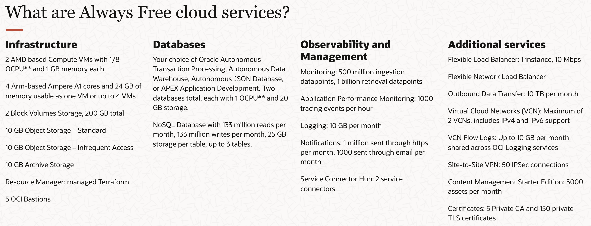

# Talk - Kubernetes cluster with Oracle Cloud

> This talk is only translated in french atm.

## Introduction

Bonjour à toutes, tous, surtout à toutes. 😏

Je m'appelle Anthony Pillot. Je suis directeur technique chez Zenika depuis maintenant plus de 10 ans.

> Vous m'avez certainement croisé au détour d'un audit de performance, ou de prestigieuses formations données chez de nombreux clients. Notemment en la présence de Logan Hauspie, mon DTJ (Directeur Technique Junior pour les ignards), que j'accompagne et que je forme chez Zenika, depuis maintenant plus de 4 jours.

Après cette présentation plus que véridique, j'aimerais revenir à des sujets un peu plus sérieux.

Je suis développeur. Le soir je m’ennuie parfois. Avec ce foutu virus, encore plus.

_(Notez la rime s’il vous plaît. J'ai rarement été aussi inspiré.)_

## Use case

Je développe donc des projets personnels, parfois. Et dans ces (trop) rares cas, je fais un joli docker-compose avec ce dont j’ai besoin pour développer.

> Mon POC prend de l’essor, et j’aimerais le présenter potentiellement à d’autre personne. Ou tout du moins arrêter d'allouer `6 giga octet` de ma machine pour les ressources de Docker.

J’aimerais donc posséder une infrastructure fonctionnelle, performante, **prod-ready** (ou en tous cas, **qualif-ready**), sécurisée, et tant qu’à faire, avec des technologies modernes. Mais je n'ai plus d'argent, tout mon budget est alloué à l'achat d'une Mustang GT.

Le baremetal c’est rigolo, mais c’est jamais assez suffisant finalement si ce n'est dépensser plus de 20€ par mois chez OVH, pour [plusieurs VPS chez OVH](https://www.ovhcloud.com/fr/vps/).

> Ce qui est _plus ou moins_ un équivalent à ce qu'il va suivre en terme de performance, et tout ça gratuitement.

## Mise en contexte des différents `Public Cloud providers`

Il existe bien sûr des `Public Cloud providers` que vous connaissez tous, et qui propose eux aussi des resources gratuites.

> `GCP` par exemple, propose quelques resources gratuites mais, si vous avez le malheur d'utiliser une resource qui n'est pas comprise dans ces resources, vous payez. Et personne ne vous préviendra si vous utilisez une resource qui n'est pas dans les resources gratuites. J'en ai fait les frais. Sans compté que les resources gratuites sont extrêmement limitées (Un `e2-micro` à `2 vCPU` et `1 Go` de RAM, _super merci mec_). Évidemment, on oublie tous les `GKE` et autre, qui ne sont absolument pas compris dans ce `Free Tier`.

Et c'est là que je trouve `Oracle Cloud Infrastructure`, par le biais de notre merveilleux Slack _qui est une mine d'information sans fin, soit dit en passant_. Et plus précisement grâce au [message de Loic Mathieu](https://zenika.slack.com/archives/G01HZ4T67AB/p1622035254013500), Grand Maître Ingénieur Évangéliste du framework `Java Quarkus`, qui m'a donné l'envie de me pencher sur cette offre.

## Présentation d'`Oracle Cloud Infrastructure`

Et donc, en Octobre 2016, `Oracle`, cette merveilleuse entreprise, appréciée de tous les acteurs de l'IT, a donc sorti `Oracle Cloud Infrastructure`.

Un service de `Public Cloud provider` qui vise à concurrencer les autres `GCP`, `Azure`, `AWS`, pour ne citer qu'eux.

Et, afin d'attirer les développeurs sur cette nouvelle plateforme, ils proposent un _`free tier`_ nommé le `Always Free Resources`, comme de nombreux autre service de `Public Cloud` donc. Mais, celui-ci est un peu plus généreux que les autres et comme le nom de l'offre l'indique, ce sont des resources qui, sous réserve de changement d'avis de la part d'`Oracle`, sont gratuites à vie.

_(**NDLR** : Il est nécessaire, à l'inscription dans `OCI`, de renseigner sa carte bancaire, afin d'essayer d'éviter que des petits malins comme vous, ne puissiez faire autant de serveur gratuitement, installer un outil de `Cloud Computing` type `OpenStack`, créér votre propre `Public Cloud` et concurrencer `Google` !)_

## Contenu d'`OCI` - `Always Free Resources`

Nous avons donc :

- Deux petites VMs `AMDs` avec chacun : `1 core OCPU`, `1 GB memory`, `0.48 Gbps` de bande passante.
- Et surtout, une VM `ARM` avec : `4 core OCPU`, `24 GB memory`, `4 Gbps` de bande passante ; divisible en 4 petites VMs de `1 core OCPU`, `4 GB memory`, et `1 Gbps` bande passante cette fois.
- Leurs `200 GB Block Volumes Storage` ; qui sont en fait des emplacements de stockage rattachable à n'importe quelle VM.
- Deux bases de données managés de `20 GB` chacune.
- Limitation globale de bande passante chez `OCI` : `10 TB` par mois.
- Et tout un tas d'autre services et resources qui sont, apparemment, gratuite à vie.

# Démonstration !

[Note pour la démonstration](@site/docs/kubernetes/get-started-with-k3s.md).

# Pour aller plus loin

Et si cette présentation vous a intéressé et que vous souhaiteriez aller plus loin, il me sera possible de vous parler d'autre features à apporter à notre tout nouveau petit `cluster` :

- Installation de `cert-manager` pour la génération automatique de certificats SSL.
- Installation des `Ingress Kubernetes` pour le routage des applications et le load balancing.
- Mise en place de son nom de domaine, `DNS`, pour le routage des applications (e.g. `*.mon-domaine.com` ; `elastic.mon-domaine.com`, `data.mon-domaine.com`, etc.).
